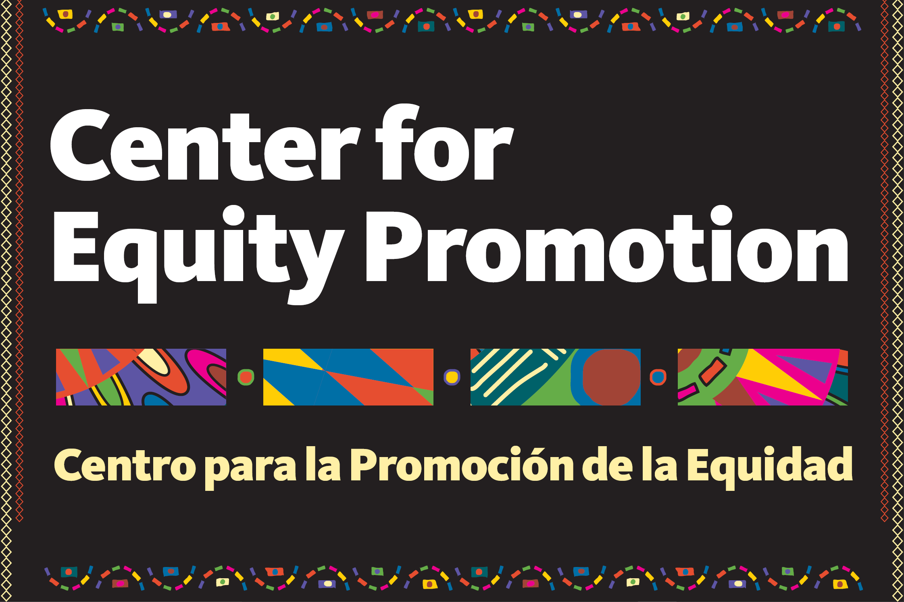

```{r setup, include=FALSE}
knitr::opts_chunk$set(message = FALSE, warning = FALSE, echo = FALSE)

library(rio)
library(here)
library(tidyverse)
library(haven)
library(janitor)
library(knitr)
library(sjPlot)
library(kableExtra)
library(psych)
"#EB519B"
```

```{r echo=FALSE}
source("R/00-librerias.R")
source("R/01-extraer.R")
source("R/02-transformar.R")
```

```{r echo=FALSE}
df_transparencia_so <- df_transparencia |> 
  filter(so_nombre == params$sujeto_obligado)
```


# Organismo: `r params$sujeto_obligado`   {-}

```{r}
table(df_transparencia_so$so_no)
```


```{r echo=FALSE, out.width="50%", fig.align="center"}
#
```

## Resultados

Aquí texto que cuente sobre un poco sobre el índice, la metodología, etc. 

- Hay link a la metodología? Puede ir en el anexo también.


### Resultados TA {-}


\pagebreak

### Resultados TP {-}

bla bla bla

```{r echo=FALSE, out.width="75%", fig.align="center"}

```


```{r echo=FALSE, out.width="75%", fig.align="center"}

```

# Resultados IT {-}

bla bla bla

## The dataset {-}

```{r include=FALSE}

#w1_raw_elt <- read_sav(here("nopublish", "ELT W1 ERC 11.11.2020.sav"))
```

bla bla bla


# Appendix  {-}

```{r echo=FALSE}

#view_df(final_elt_w1)
```

# References {-}

  Fox, R. S., Boles, H. E., Brainard, E., Fletcher, E., Huge, J. S., Martin, C. L., Maynard, W., Monasmith, J., Olivero, J., Schmuck, R., Shaheen, T. A., Stegeman, W. H. (1973). *School climate improvement: a challenge to the school administrator*. Bloomington, IN: Phi Delta Kappa Educational Foundation.

  Gibson, S., & Dembo, M. H. (1984). Teacher efficacy: A construct validation. *Journal of Educational Psychology*, 76(4), 569.

  Hoy, W. K., & Tschannen-Moran, M. (2007). *The conceptualization and measurement of faculty trust in schools: The Omnibus T-Scale*. In Hoy, W. K., & DiPaola, M. (Eds.). Essential ideas for the reform of American schools (pp. 87-114). Charlotte, NC: IAP.

  Hoy, W. K., & Woolfolk, A. E. (1993). Teachers' sense of efficacy and the organizational health of schools. *The Elementary School Journal*, 93(4), 355-372.
